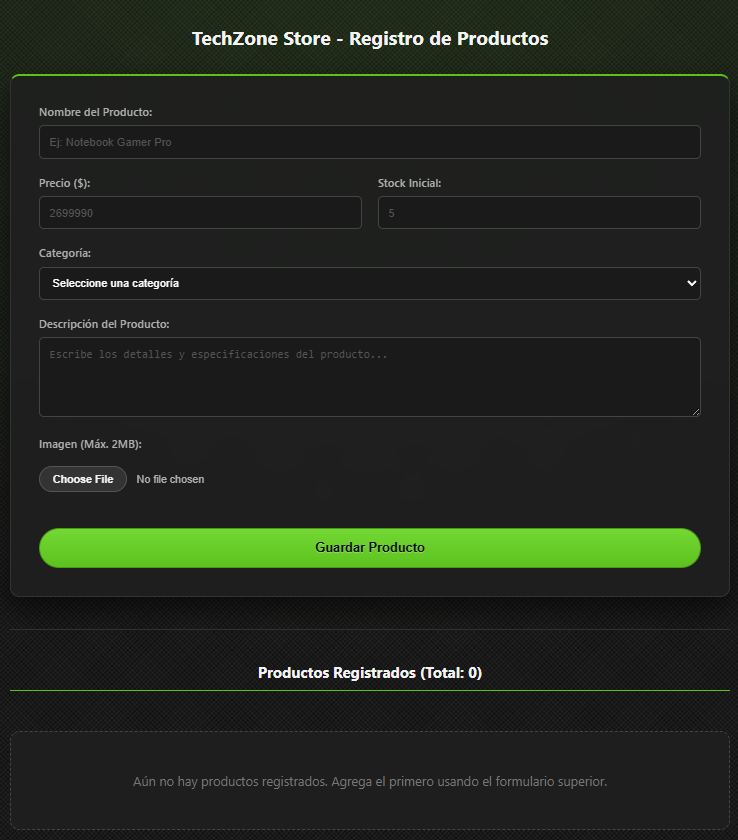
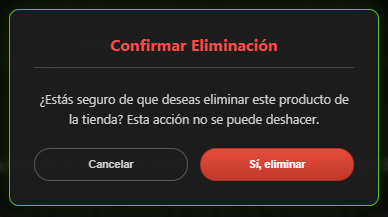
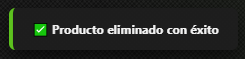

# 🛒 TechZone Store

Una aplicación web desarrollada en React para la gestión y registro de productos tecnológicos, destacando por su fluidez y un diseño inmersivo estilo "Dark Mode Gamer".

## 🚀 Características Principales

* **Registro de Productos:** Formulario dinámico para ingresar el nombre, precio, categoría, descripción y stock inicial.
* **Validaciones en Tiempo Real:** Control estricto de campos obligatorios, prevención de precios o stock negativos, y manejo de errores visibles en pantalla.
* **Gestión de Imágenes:** Sistema para subir imágenes con vista previa inmediata y validación de tamaño máximo (límite de 2MB).
* **Listado Dinámico:** Visualización en formato de tarjetas (cuadrícula responsiva) de todos los productos registrados.
* **Interactividad Extra:**
  * Contador dinámico del total de productos en inventario.
  * Botón funcional para eliminar productos individuales de la lista, respaldado por un modal de confirmación seguro y personalizado.
  * Notificaciones flotantes (Toasts) animadas que brindan retroalimentación al usuario sin interrumpir su flujo.
* **Diseño UI/UX:** Interfaz moderna, limpia y totalmente responsiva utilizando CSS3 puro.

## 🖼️ Vistazo al Proyecto







## 💻 Tecnologías Utilizadas

* **HTML5**
* **CSS3** (Flexbox, Grid, gradientes avanzados y animaciones Keyframes)
* **JavaScript (ES6+)**
* **ReactJS** (Hooks: `useState`, manejo de eventos, renderizado condicional de listas y temporizadores).

## ⚙️ Instalación y Uso

Para evaluar o correr este proyecto en tu entorno local, sigue estos pasos:

1. Descarga los archivos del proyecto o clona el repositorio.
2. Abre la terminal y navega hasta el directorio raíz del proyecto.
3. Instala todas las dependencias necesarias ejecutando el siguiente comando:
   ```bash
   npm install
   ```
4. Una vez finalizada la instalación, levanta el servidor de desarrollo local:
   ```bash
   npm start
   ```
5. La aplicación se abrirá automáticamente en tu navegador por defecto (usualmente en `http://localhost:3000`).

## 👨‍💻 Creadores

* **Alexander Pinto** - [Perfil de GitHub](https://github.com/elale06)
* **Maximiliano Beiza** - [Perfil de GitHub](https://github.com/MaximilianoB03)